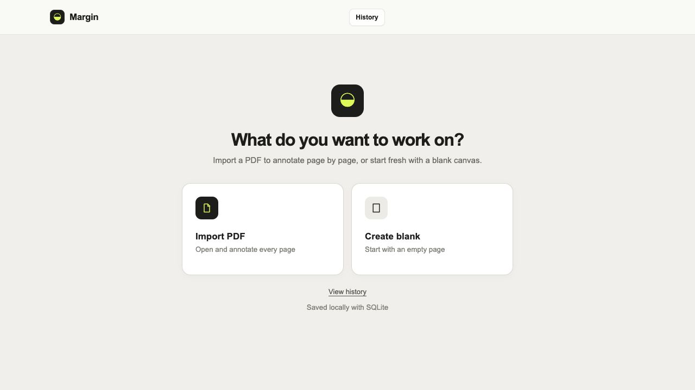
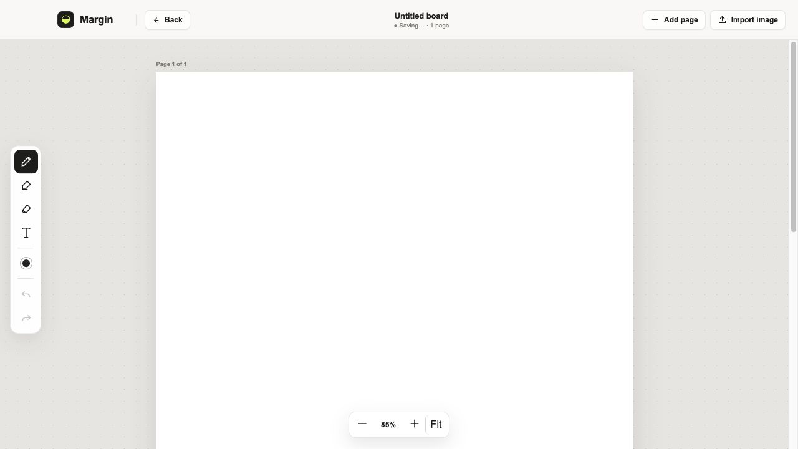

<div align="center">

# Margin

**Think beside the page.**

A local-first desktop workspace for PDF annotation, visual notes, and freehand thinking.

[Download](https://github.com/wangzhongren/Margin/releases/latest) · [Report an issue](https://github.com/wangzhongren/Margin/issues) · [Build from source](#development)

</div>



## What is Margin?

Margin gives documents room to breathe. Import a PDF and write beyond its original boundaries, or create a blank multi-page workspace for drawings, images, and movable notes.

It is designed as a private desktop tool: your PDFs, images, annotations, and history are stored locally in SQLite and never uploaded to a third-party service.

> Margin 是一款本地优先的桌面批注工具。你可以逐页阅读 PDF，在页面两侧记录想法，也可以创建多页空白画布进行绘画和整理。

## Download

Download the latest installers from [GitHub Releases](https://github.com/wangzhongren/Margin/releases/latest).

| Platform | Package |
| --- | --- |
| Windows x64 | `Margin.Setup.*.exe` |
| macOS Apple Silicon | `Margin-*-arm64.dmg` |
| macOS Intel | `Margin-*.dmg` |

Margin is currently unsigned. On first launch, macOS or Windows may display a security warning. Only download builds published from this repository.

## The workspace



### Read and annotate PDFs

- Render PDFs page by page with PDF.js
- Write in dedicated margins on both sides of every page
- Draw, highlight, erase, and add movable text notes
- Keep the original document layout visible while expanding the thinking space

### Create freely

- Start with a blank page instead of importing a document
- Add as many pages as you need
- Import PNG, JPEG, WebP, and GIF images
- Draw and place text directly over imported images

### Continue later

- Save changes automatically in the background
- Reopen previous work from History
- Persist PDFs, images, drawings, notes, and page structure
- Delete projects without managing files manually

## Tools

| Tool | Purpose |
| --- | --- |
| Pen | Freehand drawing with a custom color |
| Highlighter | Translucent emphasis over documents |
| Eraser | Remove drawn strokes visually |
| Text | Add editable notes and drag them to a new position |
| Undo / Redo | Step through drawing changes |
| Zoom | Fit the page or inspect details |

## Local data and privacy

Margin does not require an account or cloud service.

Desktop data is stored at:

```text
macOS: ~/Library/Application Support/Margin/data/boards.sqlite
Windows: %APPDATA%/Margin/data/boards.sqlite
```

The database contains project metadata, annotation state, imported images, and original PDF data. Removing the database resets local history, so back it up before reinstalling or moving to another computer.

## Technology

- React 19 and TypeScript
- Electron
- Vite
- PDF.js
- Express
- SQLite with `better-sqlite3`
- SVG annotation overlays

## Development

### Requirements

- Node.js 22+
- npm

### Run the web development environment

```bash
git clone git@github.com:wangzhongren/Margin.git
cd Margin
npm install
npm run dev
```

The frontend runs at `http://127.0.0.1:5173` and the local API at `http://127.0.0.1:3001`.

### Run as an Electron app

```bash
npm run desktop
```

### Build installers locally

```bash
# macOS
npm run dist:mac

# Windows
npm run dist:win
```

Build outputs are written to `release/`. GitHub Actions also builds Windows x64, macOS Apple Silicon, and macOS Intel packages for every push to `main`. Tags matching `v*` publish a GitHub Release automatically.

## Project structure

```text
Margin/
├── .github/workflows/     # Cross-platform desktop builds
├── docs/images/           # README screenshots
├── electron/              # Electron main process
├── server/                # Express API and SQLite persistence
├── src/                   # React workspace and interface
├── data/                  # Local web-development database
├── package.json
└── vite.config.ts
```

## Roadmap

- Export annotated projects back to PDF
- Page thumbnails and document navigation
- Selection, resizing, and richer text formatting
- Search across projects and notes
- Keyboard shortcuts and native application menus
- Optional encrypted synchronization

## Contributing

Issues and pull requests are welcome. For larger interaction or data-model changes, please open an issue before starting implementation.

## License

No open-source license has been selected yet. Unless a license is added, the source remains under the repository owner's copyright.
